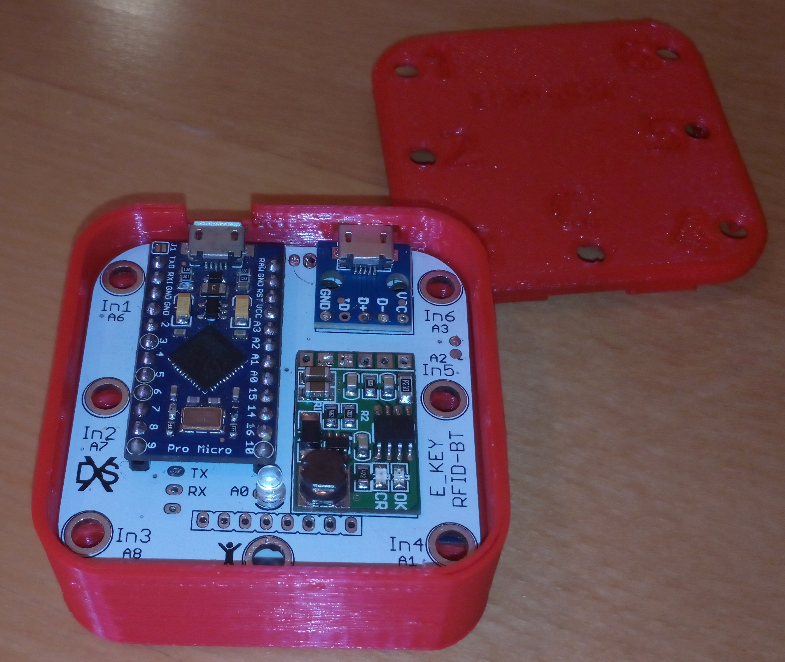

## E_KEY_BT
Escornabot keyboard with MakeyMakey type sensors.
   Any object that is minimally conductive can be used. Adjusting the value
   threshold: higher for less sensitivity, nothing needs to be changed in the
   robot firmware.
   
## License

Every content in this repo, otherwise specified under subdirectories, is
licensed under [Creative Commons BY-SA][LICENSEcc] or [CERN Open Hardware Licence -W- V2][OHL-W-V2].
(by [XDeSIG][XDE01])

## To buy boards

Developer don't produce boards to sell. Under [_provider_][provider]
directory there are instructions to order yourself.

Are you a board provider? Please, send us your buyer's guide! :-)

[imax]: https://github.com/xdesig/escornabot-electronics/blob/master/Electronics/E_KEY_BT/IMG_20180619_093516.jpg

[XDE01]: https://twitter.com/xdesig
[provider]: https://www.pcbway.com/project/member/?bmbno=6FE4DE76-9D11-4C
[LICENSEcc]: https://creativecommons.org/licenses/by-sa/3.0/es
[OHL-W-V2]: https://ohwr.org/project/cernohl/wikis/Documents/CERN-OHL-version-2
