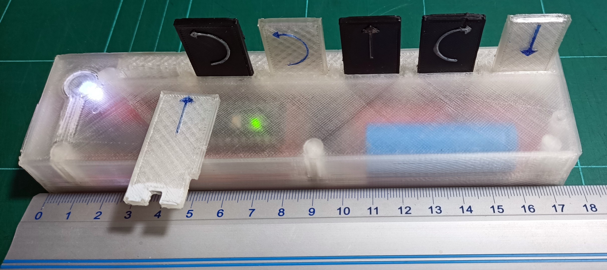
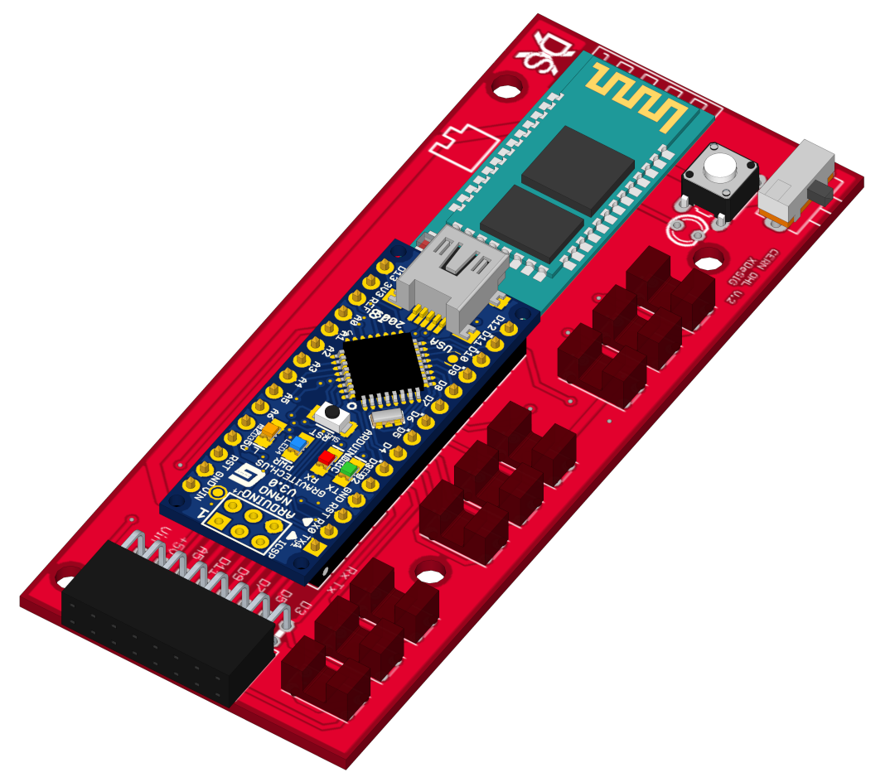
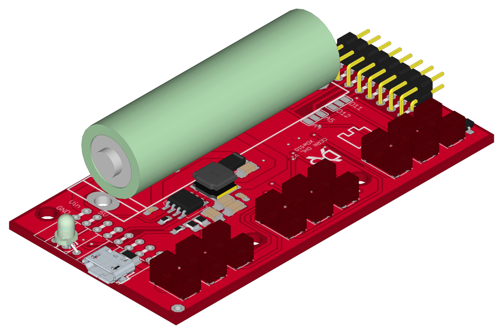
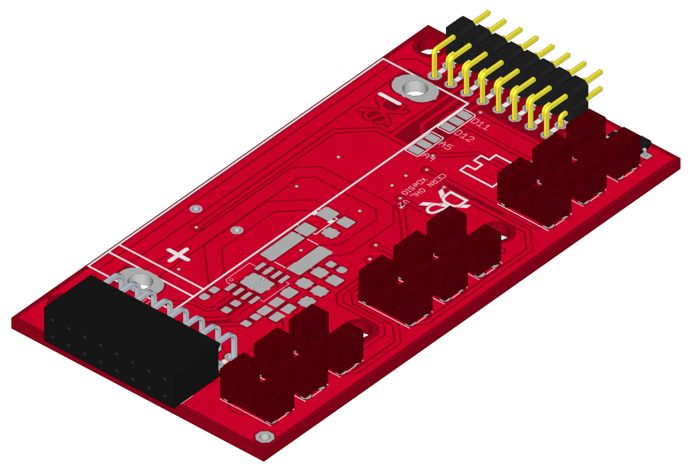
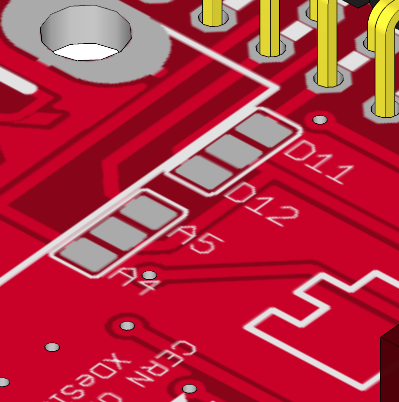
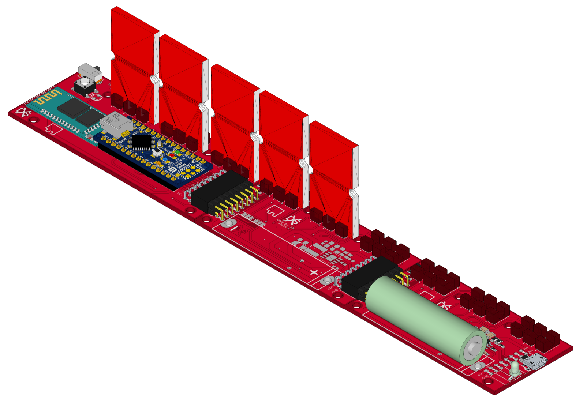

## EscornabotFicha   
                     certification.oshwa.org/list.html
## E_KEY_FICHA (Tag)
It allows the programming of Escornabot using printed or cut-out cards (cardboard ..) communicating the commands via Bluetooth 
using @arduino Nano, easy to print, manageable and expandable to 15 "Tabs" thanks to the firmware of @caligari_pub.
   

## Number of Tags (Fichas)
To use six tags we need the PCBs E_KEY_T_1_V and E_KEY_T_2_V the latter with the power components.

 If we want to have more chips (9 to 15) we will put intermediate circuits E_KEY_T_2_V without the power supply electronics.

The selection will always be configured on the end plates, according to the firmware "configuration.h".

## License hardware and docu.

Every content in this repo, otherwise specified under subdirectories, is
licensed under [Creative Commons BY-SA][LICENSEcc] or [CERN Open Hardware Licence -W- V2][OHL-W-V2].
(by [XDeSIG][XDE01])

## License software.
  Copyright (C) 2020  Rafa Couto <caligari@treboada.net>
    This program is free software: you can redistribute it and/or modify
    it under the terms of the GNU General Public License as published by
    the Free Software Foundation, either version 3 of the License, or
    (at your option) any later version.
    This program is distributed in the hope that it will be useful,
    but WITHOUT ANY WARRANTY; without even the implied warranty of
    MERCHANTABILITY or FITNESS FOR A PARTICULAR PURPOSE.  See the
    GNU General Public License for more details.
    You should have received a copy of the GNU General Public License
    along with this program.  If not, see <https://www.gnu.org/licenses/>.

## Certification OSHWA [ES000024][OSHWAes000024]

## To buy boards

Developer don't produce boards to sell. Under [_provider_][provider]
directory there are instructions to order yourself.

Are you a board provider? Please, send us your buyer's guide! :-)

[imax]: https://github.com/xdesig/escornabot-electronics/blob/master/Electronics/E_KEY_BT/IMG_20180619_093516.jpg

[XDE01]: https://twitter.com/xdesig
[provider]:  http://
[LICENSEcc]: https://creativecommons.org/licenses/by-sa/3.0/es
[OHL-W-V2]: https://ohwr.org/project/cernohl/wikis/Documents/CERN-OHL-version-2
[OSHWAes000024]: https://certification.oshwa.org/es000024.html