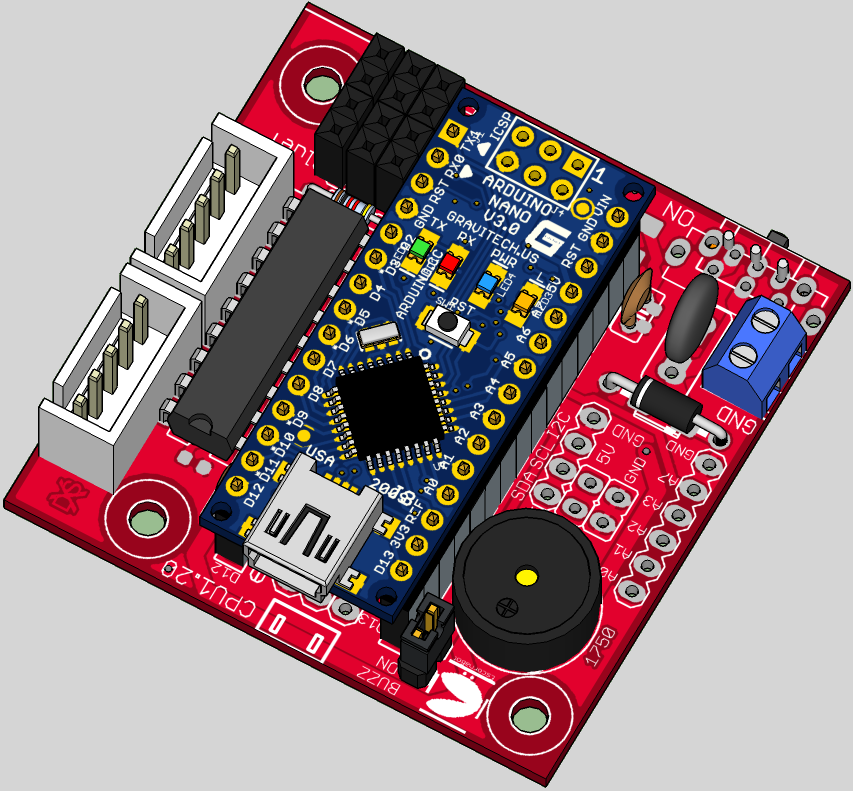

## Escorna CPU 1.20

It allows to include an Arduino Uno for the control of the robot, an ESP-01 or Bluetooth (for communications).
You can connect them to different keypads to manage the robot, I recommend the [E_KEYPAD_2.20]

## License

Every content in this repo, otherwise specified under subdirectories, is
licensed under [CERN Open Hardware Licence -W- V2][OHL-W-V2].
(by [XDeSIG][XDE01])

## To buy boards

Developer doesn't produce boards to get money. [provider]

Are you a board provider? Please, send us your buyer's guide! xdesig@gmail.com

[XDE01]: https://twitter.com/xdesig
[provider]: https://www.pcbway.com/project/shareproject/W50475ASN23_Escorna_CPU_1_20.html
[LICENSEcc]: https://creativecommons.org/licenses/by-sa/3.0/es
[OHL-W-V2]: https://ohwr.org/project/cernohl/wikis/Documents/CERN-OHL-version-2
[E_KEYPAD_2.20]: https://github.com/xdesig/escornabot-electronics/tree/master/Electronics/E_KEYPAD/E_KEYPAD_2.20
