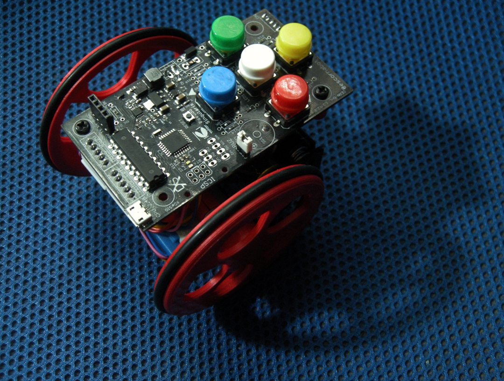
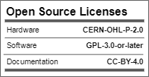
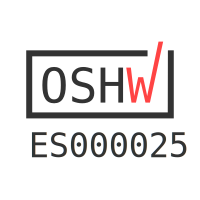

## Escorna CPU 2.4
This PCB integrates an ATmega328P, a step-up (great to use with 1.2V batteries, suggestion made by [caligari](https://github.com/rafacouto)) and the rest of the electronics needed to build a full-compatible Escornabot.
USB communications are supported by CH340E 
Arduino Uno, Arduino Nano compatible or ATmega minicore

   
## License

    

## Open Hardware Certification program

      

## To buy boards

Developer doesn't produce boards to get money. [_provider_][provider]

Are you a board provider? Please, send us your buyer's guide! xdesig@gmail.com

[XDE01]: https://twitter.com/xdesig
[provider]: https://www.pcbway.com/project/shareproject/Escorna_CPU_2_4.html
[LICENSEcc]: https://creativecommons.org/licenses/by-sa/3.0/es
[OHL-W-V2]: https://ohwr.org/project/cernohl/wikis/Documents/CERN-OHL-version-2
