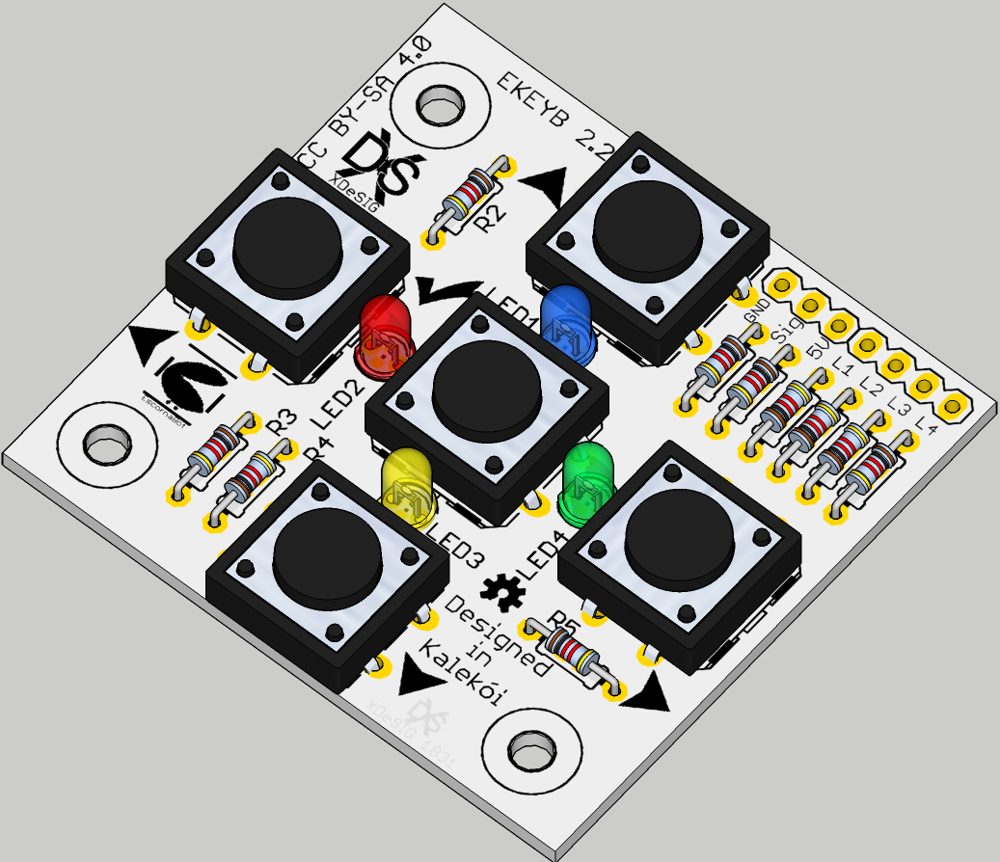

# E_keyPad 2.20

## Catalog

- [Keypad][KEY01] (by [Xdesig][XDE01]) is a 50x50mm board with 5 buttons, 4 LEDs and
  connects to any Escornabot.

## License

Every content in this repo, otherwise specified under subdirectories, is
licensed under [Creative Commons BY-SA](LICENSE).

## To buy boards

Developers don't produce boards to sell. Under [PCBWAY]

[KEY01]: Keypad
[PCBWAY]: https://www.pcbway.com/project/shareproject/E_KEYPAD_2_2.html
[XDE01]: https://twitter.com/xdesig
